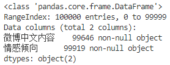
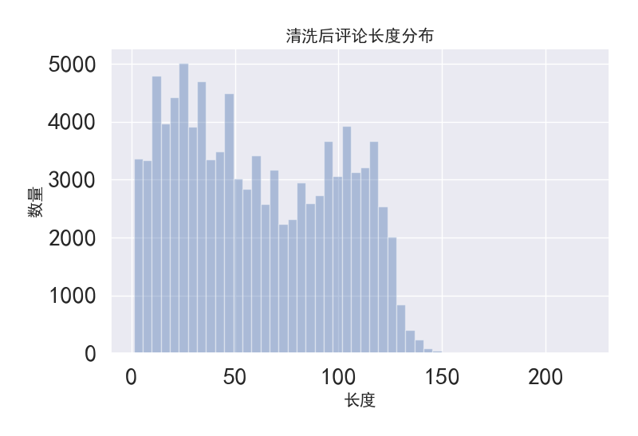
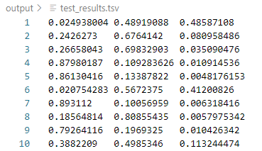
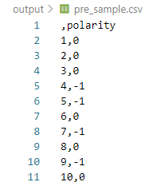
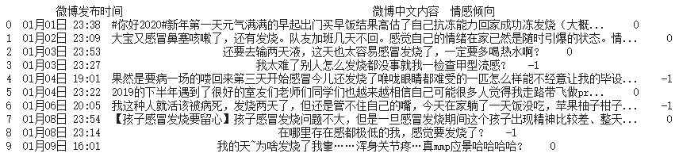
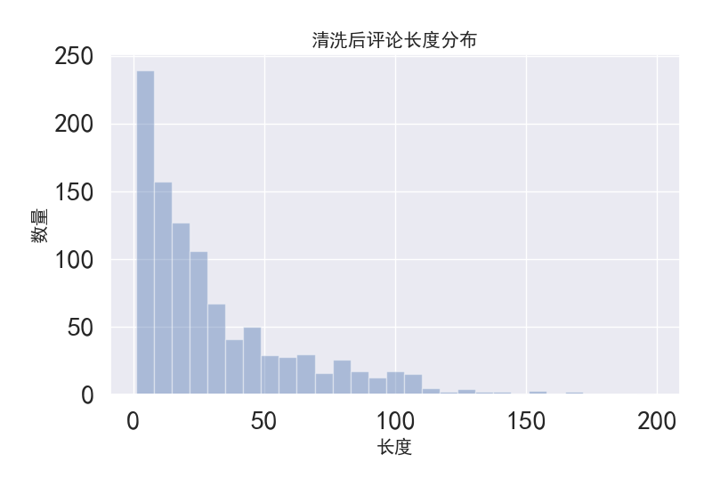

# RoBERTa_Emotion_Classification

本实验是以 DataFountain 平台的[**《疫情期间网民情绪识别》**](https://www.datafountain.cn/competitions/423)比赛为背景，使用类 BERT 预训练模型（`RoBERTa-wwm-ext, Chinese`）对微博短评论文本进行中文情感分类，划分为**积极的、中性的和消极的**三类。

本实验进行时该比赛已结束，未能通过其测试集获得最终得分排名，因此实验流程为先将该比赛提供的训练集按 8:2 的比例划分为本实验的训练集和验证集，训练原始 `RoBERTa-wwm-ext, Chinese` 模型，预测测试集的情感倾向。

最后，尝试将[**SMP2020—微博情绪分类评测（EWECT）**](https://smp2020ewect.github.io/)提供的“疫情微博数据集”输入该模型，进一步验证该模型经过一个微博文本数据集训练后对其它数据集的微博文本情绪的识别能力。

## 1. 准备操作

### 1.1. 环境配置要求

BERT 模型要求 Tensorflow 版本不能太低。

```
tensorflow >= 1.11.0   # CPU Version of TensorFlow.
tensorflow-gpu  >= 1.11.0  # GPU version of TensorFlow.
```

实际操作还发现 Tensorflow 2.x 中不少代码的使用相较于 1.x 有改变，导致许多开源代码无法直接使用，因此本人更推荐使用 1.x 版本。

我自己的版本如下：

```
Python 3.7.4 (default, Aug  9 2019, 18:34:13) [MSC v.1915 64 bit (AMD64)] :: Anaconda, Inc. on win32
Type "help", "copyright", "credits" or "license" for more information.
>>> import tensorflow as tf
>>> tf.__version__
'1.13.2'
```

环境配置流程可参考[神经网络学习小记录42——windows下的tensorflow-gpu=1.13.2环境配置](https://blog.csdn.net/weixin_44791964/article/details/104702142)。

### 1.2. Clone BERT 代码

本实验为减少工作量，选择基于 CSDN 用户[@另请高明 的代码基础](https://blog.csdn.net/qq_43012160/article/details/102767508)进行，其代码使用基本与 [Google 官方](https://github.com/google-research/bert)一致。

### 1.3. 下载预训练模型

预训练模型可以在 GitHub 等开源代码库中找到，这里选用的是**哈工大讯飞联合实验室（HFL）**提供的 TensorFlow 版 **RoBERTa-wwm-ext, Chinese** 模型，详细介绍和使用可以转至[其 GitHub 页面](https://github.com/ymcui/Chinese-BERT-wwm/)查看。

```
chinese_roberta_wwm_ext_L-12_H-768_A-12
    |- bert_model.ckpt      # 模型权重
    |- bert_model.meta      # 模型meta信息
    |- bert_model.index     # 模型index信息
    |- bert_config.json     # 模型参数
    |- vocab.txt            # 词表
```

### 1.4. TF Metrics 

根据比赛要求，采用 **Macro-F1 值**进行评价，需要在原始 Tensorflow 环境增加 [`tf_metrics`](https://github.com/guillaumegenthial/tf_metrics) API 帮助计算。

> [**《BERT模型在多类别文本分类时的precision, recall, f1值的计算》**](https://www.cnblogs.com/jiangxinyang/p/10341392.html)：
>
> Tensorflow 只提供了二分类的 precision，recall，f1 值的计算接口，而 BERT 源代码的 run_classifier.py 文件中训练模型、验证模型等都是用的 estimator API，这些高层API极大的限制了修改代码的灵活性。

## 2. 实验操作

### 2.1. 数据预处理

《疫情期间网民情绪识别》比赛提供的[训练集](https://www.datafountain.cn/competitions/423/datasets)中 `nCoV_100k_train.labled.csv` 包含 10 万条用户标注的微博数据，具体格式如下：[微博id,微博发布时间,发布人账号,微博中文内容,微博图片,微博视频,情感倾向]，其中情感倾向分别为 1（积极），0（中性）和 -1（消极）。

`DataClean.py`

由于原始数据集文件是 GB2312 格式编码，需要先将其转为 utf-8 格式再读取。

接着，进行数据读取与预处理。由于本实验主要研究网民发布的中文评论文本与情感倾向之间的关系，暂不对“微博 id”、“微博发布时间”、“发布人账号”、“图片”和“视频”等数据进行详细分析与描述，而**主要是对“微博中文内容”和“情感倾向”两列的内容进行统计和分析**。

可以看出，虽然该数据集提供了 10 万条数据，但“微博中文内容”列中只有 99646 条内容不为空，“情感倾向”列中只有 99919 条带有标注。在后续实验中，需要去除内容为空的数据，优化模型的分类能力。



“微博中文内容”的预处理：**分析文本特征**，由于大多微博文本包含诸如“展开全文”、“网页链接”、定位信息和分享音乐时带上的“网易云音乐”“QQ音乐”等**与情绪结果没有相关性的关键字**，应该使用空字符替换。其次，**部分文本因为回复或转发微博而含有用户名**，体现为“//@用户名”“回复@用户名：”等固定结构，部分用户名往往很长且带有与情绪相关的词语，却与实际文本情绪无关而形成干扰。考虑到文本中的表情符号能一定程度体现用户的情感倾向，但很可惜的是，分析文本时发现所有表情符号都被识别成特殊符号“??”，无法作为模型对文本情绪的分类参考。另外，选用 **Jieba 中文分词工具**进行分词处理，使用**哈工大停用词表** `hit_stopwords.txt` 去除停用词。完成文本的清洗后**统计文本长度分布**，将模型最大分析句长的参数值设定在既能涵盖绝大多数文本，又能减少程序运行时间。



“情感倾向”的预处理：虽然赛题将情感标签分为 3 类，但当分析“情感倾向”的标签分布时 ，发现除正常分类标签{1，0，-1}外，还包含少量{2，4，9，10，-，·，NaN}等非法标签。在后续数据处理中需要去除这些非法标签，避免影响模型的正确识别分类能力 。

| 清洗前“情感倾向”列所有标签值 | 数量  |
| :--------------------------: | :---: |
|              0               | 57619 |
|              1               | 25392 |
|              -1              | 16902 |
|             NaN              |  81   |
|              -               |   1   |
|              ·               |   1   |
|              10              |   1   |
|              -2              |   1   |
|              9               |   1   |
|              4               |   1   |

数据集完成数据预处理后剩余 99560 条可用数据，使用 `DataCutOff.py` 进行随机打乱，按 8：2 的比例划分为本实验的训练集和验证集，即训练集 `train.csv` 含有 79648 条数据，验证集 `val.csv` 含有 19912 条数据。

若有需要，可使用 `DataAnalysis.py` 对数据集进行可视化处理，包括“微博数量与发布日期的关系分布图”、“每日微博情感占比变化分布图”、“评论长度分布图”和“评论长度分布与情感倾向关系图”。

### 2.2. 代码修改

因为本实验属于分类任务，所以 BERT 代码中对 `run_classifier.py` 进行修改或编写类似的具体任务文件。

### 2.2.1. 编写任务处理类

`run_classifier.py` 自带 4 个任务处理类，其中 `class ColaProcessor(DataProcessor)` 属于单句的文本二分类任务处理类，与此次实验目标情绪识别分类处理最相近，因此模仿它编写一个处理类。

```python
class MyTaskProcessor(DataProcessor):
    """Processor for my task-news classification """

    def __init__(self):
        self.labels = ['-1', '0', '1']

    def get_train_examples(self, data_dir):
        return self._create_examples(
            self._read_csv(os.path.join(data_dir, 'train.csv')), 'train')

    def get_dev_examples(self, data_dir):
        return self._create_examples(
            self._read_csv(os.path.join(data_dir, 'val.csv')), 'val')

    def get_test_examples(self, data_dir):
        return self._create_examples(
            self._read_csv(os.path.join(data_dir, 'test.csv')), 'test')

    def get_labels(self):
        return self.labels

    def _create_examples(self, lines, set_type):
        """create examples for the training and val sets"""
        examples = []
        for (i, line) in enumerate(lines):
            guid = '%s-%s' % (set_type, i)
            text_a = tokenization.convert_to_unicode(line[0])
            label = tokenization.convert_to_unicode(line[1])
            examples.append(InputExample(guid=guid, text_a=text_a, label=label))
        return examples
```

`class DataProcessor(object)` 是所有任务处理数据类的父类，包含了一个读取 tsv 数据集的方法 `def _read_tsv`。由于本实验所用的是列之间以 `,` 间隔的 csv 数据集，需要修改成 `def _read_csv`。

```python
	def _read_csv(cls, input_file, quotechar=None):
        """Reads a comma-separated value file."""
        with tf.gfile.Open(input_file, "r") as f:
            reader = csv.reader(f, delimiter=",", quotechar=quotechar)
            lines = []
            for line in reader:
                lines.append(line)
            return lines
```

### 2.2.2. 处理类注册

修改程序入口 `def main(_)`，把我们的任务处理类加进去并赋予调用参数，即参数值为 `mytask` 时，表示程序调用 `class MyTaskProcessor(DataProcessor)`。

```python
def main(_):
    tf.logging.set_verbosity(tf.logging.INFO)

    processors = {
        "mytask": MyTaskProcessor,
    }
```

### 2.2.3. 评价指标

参考 BERT 官方代码的 Issues [#800](https://github.com/google-research/bert/issues/800)，增加 Macro-F1 值的计算需要在官方代码 `run_classifer.py` 的 line (684-692) 稍作修改。

```python
def metric_fn(per_example_loss, label_ids, logits, is_real_example):
	predictions = tf.argmax(logits, axis=-1, output_type=tf.int32)
	accuracy = tf.metrics.accuracy(
        	labels=label_ids, predictions=predictions, weights=is_real_example)
	loss = tf.metrics.mean(values=per_example_loss, weights=is_real_example)
	precision, update_op_precision = tf.metrics.precision(labels=label_ids,
			predictions=predictions, weights=is_real_example)
    recall, update_op_recall = tf.metrics.recall(labels=label_ids,
			predictions=predictions, weights=is_real_example)
    f1 = 2. * precision * recall / (precision + recall)
    f1_op = 2. * update_op_precision * update_op_recall / (update_op_precision + update_op_recall)
    macro_precision = tf_metrics.precision(label_ids, predictions, num_classes=3, average='macro')
    macro_recall = tf_metrics.recall(label_ids, predictions, num_classes=3, average='macro')
    macro_f1_score = tf_metrics.f1(label_ids, predictions, num_classes=3, average='macro')
    return {
        "eval_accuracy": accuracy,
        "eval_loss": loss,
        "precision": (precision, update_op_precision),
        "recall": (recall, update_op_recall),
        "f1 score": (f1, f1_op),
        "macro precision": macro_precision,
        "macro recall": macro_recall,
        "macro f1_score": macro_f1_score,
    }
```

## 2.3. 程序运行

程序的运行需要使用命令行传入参数。假设程序代码所在目录为 `D:\python\RoBERTa`，则通过以下命令激活运行环境，进入该目录，即可开始传入参数运行。。

```shell
activate tensorflow
d:
cd python\RoBERTa
```

### 2.3.1 Fine-tuning

训练 + 验证命令：

```shell
python run_classifier.py --task_name=mytask --do_train=true --do_eval=true --data_dir=data --vocab_file=chinese_roberta_wwm_ext_L-12_H-768_A-12\vocab.txt --bert_config_file=chinese_roberta_wwm_ext_L-12_H-768_A-12\bert_config.json --init_checkpoint=chinese_roberta_wwm_ext_L-12_H-768_A-12\bert_model.ckpt --max_seq_length=150 --train_batch_size=16 --learning_rate=1e-5 --num_train_epochs=2.0 --output_dir=output
```

- `task_name` 指此次运行 `def main(_)` 中的哪一个任务，这里传入 `mytask` 表示运行 `MyTaskProcessor` 处理类。
- `do_train` 指是否进行训练。`do_eval` 指是否进行验证。
- `data_dir` 指存放数据集的目录。
- `vocab_file`、`bert_config_file`、`init_checkpoint` 对应此次使用 BERT 模型的几个文件。
- `max_seq_length` 指输入模型的最大句长。
- `batch_size` 指最大并行数，表示多少个文本同时处理。
- `learning_rate` 指学习率。
- `num_train_epochs` 指迭代次数。
- `output_dir` 指输出目录，这里传入 `output` 表示训练后的模型文件以及验证结果 `eval_results.txt` 等文件将保存在根目录下的 `output` 文件夹内。

如果遇到内存不够而程序中止运行，可以把 `max_seq_length` 和 `batch_size` 调小。

待程序运行结束后，将显示类似如下结果。此时即可通过调整参数进行结果微调。

```
INFO:tensorflow:***** Eval results *****
INFO:tensorflow:  eval_accuracy = 0.745229
INFO:tensorflow:  eval_loss = 0.5968201
INFO:tensorflow:  f1 score = 0.92563075
INFO:tensorflow:  global_step = 9956
INFO:tensorflow:  loss = 0.5968201
INFO:tensorflow:  macro f1_score = 0.71414566
INFO:tensorflow:  macro precision = 0.71518034
INFO:tensorflow:  macro recall = 0.7138168
INFO:tensorflow:  precision = 0.92018723
INFO:tensorflow:  recall = 0.9311392
```

### 2.3.2. 预测分类

测试命令：

```shell
python run_classifier.py --task_name=mytask --do_predict=true --data_dir=data --vocab_file= chinese_roberta_wwm_ext_L-12_H-768_A-12\vocab.txt --bert_config_file= chinese_roberta_wwm_ext_L-12_H-768_A-12\bert_config.json --init_checkpoint=output --max_seq_length=128 --output_dir=output
```

待程序运行结束后，`output` 目录下生成文件 `test_results.tsv`，是 m*n 的浮点数组，m 是测试集文本数，n 是分类的类数，第 i 行第 j 列的数据表示第 i 条文本属于第 j 类的概率。此处分类的顺需与 `run_classifer.py` 定义的 `labels` 顺序相同。



接着，使用 `ProbToLabel.py` 将概率转化为该文本所属分类的标签。



## 2.4. 结果展示

由于我的个人计算机性能不佳，仅运行程序一次即耗费大量时间，因此本实验结果均使用 **Google Colaboratory** 获得，完整实验过程见 `run_classifier_with_Colab.ipynb`。

Colaboratory 提供使用的软硬件环境如下所示：

```
CPU: Intel(R) Xeon(R) CPU @ 2.20GHz
GPU: NVIDIA Tesla T4
显卡内存: 16GB
显卡学习能力: 7.5
编程语言: Python 3.7
深度学习框架: TensorFlow-GPU 1.15.2
```

为探究该模型下效果最佳的参数设置，同时节约实验时间，在原训练集中抽取 8000 条作为训练集，再抽取 2000 条作为验证集，进行多组参数设置的对照实验，结果如下表所示。**可以看出，当 `max_seq_length=150, train_batch_size=16, learning_rate=1e-5, num_train_epochs=2.0` 时，`accurary=0.7505, f1_score=0.717346`，均为最大值。**

| Max_Seq_Length | Batch_Size | Learning_Rate | Epochs | Accurary | Macro Precision | Macro Recall | Macro F1_score |
| -------------- | ---------- | ------------- | ------ | :------: | :-------------: | :----------: | :------------: |
| 150            | 8          | 1.00E-05      | 3      |  0.7345  |     0.70806     |   0.69308    |    0.700008    |
| 150            | 16         | 1.00E-05      | 1      |  0.7375  |    0.719268     |   0.671922   |    0.690919    |
| 150            | 16         | 1.00E-05      | 2      |  0.7505  |    0.728697     |   0.708058   |    0.717346    |
| 150            | 16         | 1.00E-05      | 3      |  0.7415  |    0.716521     |   0.695586   |    0.704913    |
| 150            | 16         | 1.00E-05      | 4      |  0.729   |    0.699324     |   0.694827   |    0.696999    |
| 150            | 16         | 1.00E-05      | 6      |  0.719   |    0.689149     |   0.684162   |    0.686594    |
| 140            | 16         | 1.00E-05      | 2      |  0.7385  |    0.714057     |   0.684931   |    0.697196    |
| 150            | 16         | 3.00E-05      | 2      |  0.735   |    0.708319     |   0.686798   |    0.696294    |
| 150            | 16         | 5.00E-05      | 2      |  0.732   |    0.710777     |   0.66996    |    0.686508    |
| 150            | 16         | 3.00E-05      | 3      |  0.7315  |    0.704454     |   0.686562   |    0.694762    |

> 注意：部分参数对照组数量较少，可能出现偶然情况，所得结果未必是真正的最佳参数组合。

因此，使用完整数据集在 `max_seq_length=150, train_batch_size=16, learning_rate=1e-5, num_train_epochs=2.0` 的参数设置下进行实验，所得结果如下表所示。

| Accurary | Macro Precision | Macro Recall | Macro F1_score |
| :------: | :-------------: | :----------: | :------------: |
| 0.745229 |   0.71518034    |  0.7138168   |   0.71414566   |

打印输出测试集的前 10 行预测结果，如下图所示。



## 3. 拓展

在实验过程中留意到类似的比赛还有[**SMP2020—微博情绪分类评测（EWECT）**](https://smp2020ewect.github.io/)，因此也将其“疫情微博训练数据集”运用到本实验构建的预训练模型中。

评测将微博按照其蕴含的情绪分为以下六个类别之一：积极（happy）、愤怒（angry）、悲伤（sad）、恐惧（fear）、惊奇（surprise）和无情绪（neural），为与原实验统一，**将积极用“1”替换，惊奇和无情绪用“0”替换，愤怒、悲伤、恐惧用“-1”替换**，保存为 `SMP2020_Virus.csv` 。**随机抽取 1000 条**按上文所述的预处理过程进行处理，作为二次验证集，**进一步验证该模型经过一个微博文本数据集训练后对其它数据集的微博短文本情绪的识别能力**，若依然能得到较好效果，证明该模型对于中文情感分类任务的可行性。

完成数据预处理后，其长度分布如下图所示，绝大部分评论长度在 150 字以内，与原实验一致。



验证命令：

```shell
python run_classifier.py --task_name=mytask --do_eval=true --data_dir=data --vocab_file=chinese_roberta_wwm_ext_L-12_H-768_A-12\vocab.txt --bert_config_file=chinese_roberta_wwm_ext_L-12_H-768_A-12\bert_config.json --init_checkpoint=output --max_seq_length=150 --train_batch_size=16 --learning_rate=1e-5 --num_train_epochs=2.0 --output_dir=output
```

> 注意：此时需要先将验证集文件名修改为 `val.csv`，程序才可正常读取。

结果如下表所示。可以看出，该预训练模型对 SMP2020 数据集的情绪识别能力比 DataFountain 数据集表现更好，说明该模型经过训练后的性能不受限于同一数据集的应用，对于更广泛的微博短评论文本也能满足基本的情绪识别要求。

| 验证集来源   | Accurary | Macro Precision | Macro Recall | Macro F1_score |
| :----------- | :------: | :-------------: | :----------: | :------------: |
| DataFountain | 0.745229 |   0.71518034    |  0.7138168   |   0.71414566   |
| SMP2020      | 0.789000 |   0.76934690    |  0.7734019   |   0.75055330   |

